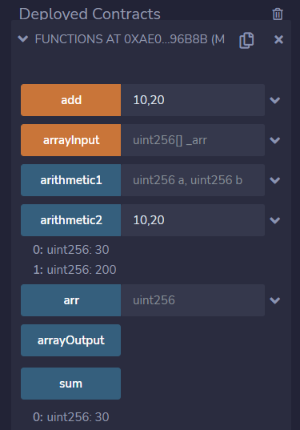

# 第11章 函数

## 基本概念

Solidity语言中关于函数的定义：

+ 函数可以在合约内部和外部定义；
+ 在合约外部定义的函数也称为”自由函数“，并始终具有隐式的`internal`可见性；

本课程我们重点介绍定义在合约内部的函数。

## 函数定义

### 语法

函数定义语法如下：

```
function <function name>(<paramslist>) <access specifier> <pure | view>
	returns(resultslist) {
	block of code;
}
```

函数由以下几个部分组成：

+ **`function`**：函数的关键字；
+ **`<function name>`**：函数名称，建议采用驼峰命名方式，首字母小写；
+ **`<paramslist>`**：参数列表，非必须；
+ **`<access specifier>`**：函数可见性（即访问权限）。有 `public`、`private`、`external` 和 `internal` 四种类型的可见性。
+ **`<pure | view>`**：状态可变性，非必须。表示是否读取或修改状态变量。
+ **`returns`**：关键字，非必须。后面跟返回变量；
+ **`resultslist`**：返回变量，非必须。允许有多个返回变量。

### 函数参数

函数参数即函数的输入参数，非必须。参数的声明方式和变量相同。

函数参数几乎可以接受所有类型，包括引用类型，但不能接受 `mapping`（映射）类型。

例如，如果我们希望合约接受有两个整数参数的函数调用，可以像下面这样写：

```
pragma solidity ^0.8.13;

contract Simple {
    uint public sum;
    function add(uint a, uint b) public {
        sum = a + b;
    }
}
```

### 返回变量

函数返回变量的声明方式在关键词 `returns` 之后，与参数的声明方式相同，所不同的是返回变量名可以被省略。

函数返回变量几乎可以接受所有类型，包括引用类型，但不能接受 `mapping`（映射）类型。

函数可以返回多个返回值。当需要多个返回值时，参数的数量需要和声明时一致。

例如，给个两个整型参数，需要同时返回和与积，可以这么写：

```
pragma solidity ^0.8.13;

contract Simple {
    function arithmetic(uint a, uint b) public pure returns(uint sum, uint product) {
        sum = a + b;
        product = a * b;
    }
}
```

在上面的例子中，我们在返回变量中定义了变量名称，通过把返回值直接付给变量，可以省略 `return` 语句。

我们也可以这么写：

```
pragma solidity ^0.8.13;

contract Simple {
    function arithmetic(uint a, uint b) public pure returns(uint, uint) {
        uint sum = a + b;
        uint product = a * b;
        return(sum, product);
    }
}
```

在这个例子中，我们没有定义返回变量的名称，而是通过 `return` 语句来返回。

## 合约例子

下面是一个合约例子，用来演示函数的声明与用法。

```
// SPDX-License-Identifier: MIT
pragma solidity ^0.8.13;

// 函数
contract Functions {
    uint public sum;
 
    // 无返回值
    function add(uint a, uint b) public {
        sum = a + b;
    }

    // 不使用return
    function arithmetic1(uint a, uint b) public pure returns(uint v1, uint v2) {
        v1 = a + b;
        v2 = a * b;
    }

    // 使用return返回多个值
    function arithmetic2(uint a, uint b) public pure returns(uint, uint) {
        // return(a + b, a * b);
        uint v1 = a + b;
        uint v2 = a * b;
        return(v1, v2);
    }

    // 接受数组作为输入
    function arrayInput(uint[] memory _arr) public pure returns(uint) {
        return _arr.length;
    }

    // 接受数组作为输出
    function arrayOutput() public pure returns(uint[] memory) {
        uint[] memory a = new uint[](3);
        for (uint i = 0; i < a.length; i++)
        	a[i] = i;
        return a;
    }
}
```

**输出** ：我们在Remix中编译、部署和运行这个合约例子，执行结果如下图：



## 课程小结

本课程我们介绍了函数，包括函数的声明语法、函数参数和函数返回变量等。并且通过合约例子演示了函数的声明与用法。


