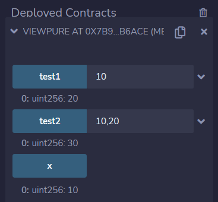

# 第12章 view和pure函数

## 基本概念

Solidity语言有两类和状态读写有关的函数类型：一类是view（视图）函数，另一类是pure（纯）函数。它们的区别是view函数不修改状态，pure函数既不修改状态也不读取状态。

## 函数类型

### View函数

`view` 函数也称为视图函数。如果函数中仅读取状态的值而不进行修改，那么可以将函数定义为 `view` 函数。

下列的语句被认为是修改状态的：

+ 修改状态变量
+ 产生事件
+ 创建其它合约
+ 使用 `selfdestruct`（销毁合约）
+ 通过调用发送以太币
+ 调用任何没有标记为 `view` 或 `pure` 的函数
+ 使用低级调用
+ 使用包含特定操作码的内联汇编

例如，下面合约中的函数是一个 `view` 函数。

```
pragma solidity  ^0.8.13;

contract Simple {
	uint public x = 10;
    function f(uint a) public view returns(uint) {
        return x + a;
    }
}
```

### Pure函数

`pure` 函数也称为纯函数。如果函数中不读取也不修改状态变量，那么可以将函数定义为 `pure` 函数。

除了上面列出的的修改状态的语句之外，以下语句被认为是读取状态的：

+ 读取状态变量
+ 访问 `address(this).balance` 或者 `<address>.balance`
+ 访问 `block`, `tx`, `msg` 中任意成员（除 `msg.sig` 和 `msg.data` 之外）
+ 调用任何未标记为 `pure` 的函数
+ 使用包含某些操作码的内联汇编

例如，下面合约中的函数是一个 `pure` 函数。

```
pragma solidity  ^0.8.13;

contract Simple {
    function f(uint a, uint b) public pure returns(uint) {
        return a + b;
    }
}
```

## 合约例子

下面是一个合约例子，用来演示view和pure函数的用法。

```
// SPDX-License-Identifier: MIT
pragma solidity ^0.8.13;

// view和pure函数
contract ViewPure {
    uint public x = 10;

    // view函数
    function test1(uint a) public view returns(uint) {
        return x + a;
    }

    // pure函数
    function test2(uint a, uint b) public pure returns(uint) {
        return a + b;
    }
}
```

**输出** ：我们在Remix中编译、部署和运行这个合约例子，执行结果如下图：



## 课程小结

本课程我们介绍了view和pure函数，包括view函数和pure函数的适用范围和两者之间的区别。并且通过合约例子演示了view和pure函数的用法。

