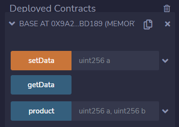
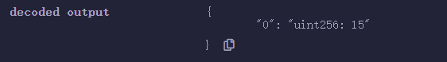
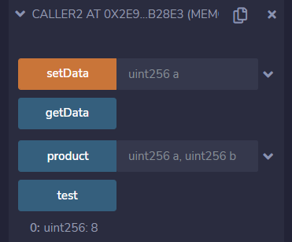
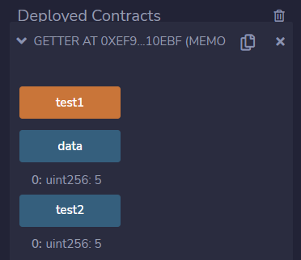
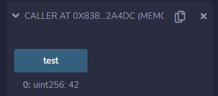

# 第13章 函数和状态变量的可见性

## 基本概念

函数和状态变量必须声明它们是否可以被其他合约访问，即函数和状态变量的可见性（访问权限）。在Solidity语言中，共有以下四类可见性标识符：

+ `public`：公共的
+ `private`：私有的
+ `internal`：内部的
+ `external`：外部的

## 状态变量可见性

状态变量有3种可见性标识符。

**`public`**

公共状态变量。与内部状态变量的不同之处在于，编译器会自动为它们生成getter函数，从而允许其他合约读取它们的值。当在同一个合约中使用时，外部访问（例如 `this.x`）调用getter，而内部访问（例如 `x`）直接从存储中获取变量值。setter函数则不会被生成，因此其他合约不能直接修改它们的值。

**`internal`**

内部状态变量。只能从定义它们的合约和派生合约中访问，外部无法访问它们。这是状态变量的默认可见级别。

**`private`**

私有状态变量。与内部状态变量类似，但在派生合约中不可见。

## 函数可见性

函数有4种可见性标识符。

**`public`**

公共函数。是合约接口的一部分，可以在内部调用，也可以通过消息调用。

**`external`**

外部函数。是合约接口的一部分，可以从其他合约或交易调用它们。一个外部函数 `f ` 不能在内部调用（即 `f()`不能工作，但 `this.f()` 可以工作）。

**`internal`**

内部函数。只能从当前合约或从当前合约派生的合约中访问，外部无法访问它们。内部函数可以接受内部类型的参数，包括映射或存储引用。

**`private`**

私有函数。类似于内部函数，但不能被派生合约调用，仅在当前合约中调用。

## Getter函数

编译器会自动为所有public状态变量创建getter函数。对于下面给出的合约，编译器会生成一个名为 `data` 的函数，该函数没有参数，并返回一个 `uint`，即状态变量 `data` 的值。状态变量可以在声明时初始化。

```
// SPDX-License-Identifier: MIT
pragma solidity ^0.8.13;

contract C {
    uint public data = 42;
}

contract Caller {
    C c = new C();
    function f() public view returns (uint) {
        return c.data();
    }
}
```

getter函数具有外部（external）可见性。如果在内部访问（即没有`this.`），它被认为是一个状态变量。如果它被外部访问（即使用 `this.`），它被认作为一个函数。

```
// SPDX-License-Identifier: MIT
pragma solidity ^0.8.13;

contract C {
    uint public data;
    function x() public {
    	data = 5;	// 内部访问
    	uint v = this.data();	// 外部访问
    }
}
```

## 合约例子

### 函数和状态变量可见性

**例子**：下面是一个完整的合约样例，演示了函数和状态变量可见性的用法。

```
// SPDX-License-Identifier: MIT
pragma solidity ^0.8.13;

// 函数和状态可变性
contract Base {
    uint private data;
    uint internal x;
    uint public y;

    function foo(uint a) private pure returns(uint) { return a + 1; }
    function setData(uint a) public { data = a; }
    function getData() public view returns(uint) { return data; }
    function sum(uint a, uint b) internal pure returns (uint) { return a + b; }
    function product(uint a, uint b) external pure returns (uint) { return a * b; }
}

// 外部合约
contract Caller1 {
    function test() public returns(uint) {
        Base c = new Base();
        uint v;
        // v = c.y();
        // v = c.foo(7);     // foo函数不可见
        c.setData(3);
        v = c.getData();
        // v = c.sum(3, 5);    // sum函数不可见
        v = c.product(3, 5);
        return v;
    }
}

// 派生合约
contract Caller2 is Base {
    function test() public pure returns(uint) {
        uint v = sum(3, 5);   // 派生合约可以访问
        return v;
    }
}
```

**输出**：我们在Remix中编译、部署和运行这个合约例子。执行结果如下图：








### Getter函数

**例子**：下面是一个完整的合约样例，演示了getter函数的用法。

```
// SPDX-License-Identifier: MIT
pragma solidity ^0.8.13;

// Getter函数
contract Base {
    uint public data = 42;

    // 内部访问
    function test1() public {
    	data = 5;
    }

    // 外部访问
    function test2() public view returns(uint) {
    	uint v = this.data();
        return v;
    }
}

// 外部调用
contract Caller {
    Base c = new Base();

    // getter调用
    function test() public view returns (uint) {
        return c.data();
    }
}
```

**输出**：我们在Remix中编译、部署和运行这个合约例子。执行结果如下图：





## 课程小结

本课程我们介绍了函数和状态变量的可见性，包括状态变量可见性和函数可见性的类型，以及Getter函数。并且通过合约例子演示了函数和状态变量可见性，Getter函数的用法。
