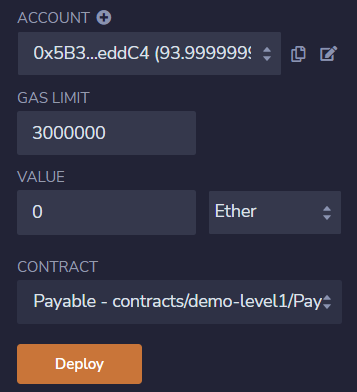
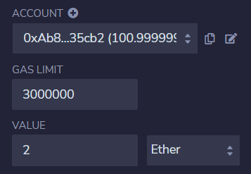
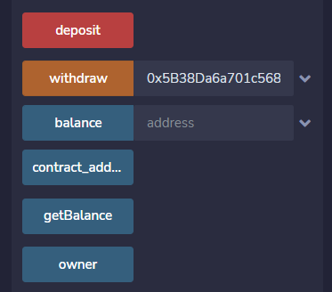

# 第17章 可支付的地址和函数

如果函数和地址被声明为可支付的（payable）就可以在合约中接收以太币。

## 可支付地址

可支付地址的声明语法如下：

```
address payable
```

如果你计划向一个以太坊地址发送以太币，那么需要申明以上的地址类型。

可支付地址有以下成员属性和函数：

+ `balance`

  查询一个地址的余额（以wei为单位）。

+ `transfer`

  转账函数。用于向一个可支付地址发送以太币（以wei为单位）。

  如果当前合约的余额不够，则 `transfer` 函数会执行失败，或者接收账户拒绝接收转账，`transfer` 函数同样会执行失败，失败时回退并抛出异常。

+ `send`

  转账函数，用于向一个可支付地址发送以太币（以wei为单位）。

  `send` 是`transfer` 的低级版本。如果执行失败，返回 `false`。

***注意：在使用 `send` 的时候会有些风险，所以为了保证以太币发送的安全，一定要检查 `send` 的返回值。考虑到安全性，建议使用 `transfer` 实现以太币转账。***

## 可支付函数

可支付函数的声明语法如下：

```
function <function name>(<paramslist>) <access specifier> payable {
	block of code;
}
```

如果你计划在一个函数中接收以太币转账，那么需要声明以上带 `payable` 关键字的函数。

## 合约例子

下面是一个合约例子，用来演示可支付地址和函数的声明与用法。

```
// SPDX-License-Identifier: MIT
pragma solidity ^0.8.13;

// 可支付的地址和函数
contract Payable {
    // 可支付地址
    address payable public owner;
    
    // 合约地址及地址余额映射
    address public contract_address;
    mapping(address => uint) public balance;

    // 构造函数
    constructor() {
        owner = payable(msg.sender);
        contract_address = address(this);
    }

    // 存入以太币到合约
    function deposit() public payable {
        balance[contract_address] = msg.value;
    }

    // 取合约地址余额
    function getBalance() public view returns(uint) {
        return balance[contract_address];
    }

    // 从合约提取以太币
    function withdraw(address payable to) public {
        require(balance[contract_address] > 1, "no enough ether");
        balance[contract_address] -= 1 ether;
        to.transfer(1 ether);
        // owner.transfer(1 ether);
    }
}
```

这个例子中，我们设计了一个可以存取以太币的合约。我们对例子中的代码做进一步的解释：

**1. 定义状态变量**

```
address payable public owner;
address public contract_address;
mapping(address => uint) public balance;
```

我们定义了以下3个状态变量：

+ owner：合约调用者帐号地址，该地址定义为可支付的（带payable关键字）；
+ contract_address：合约地址，这个地址可以接收以太币；
+ balance：合约地址及余额的映射。

**2. 初始化状态变量**

```
constructor() {
	owner = payable(msg.sender);
	contract_address = address(this);
}
```

我们定义了一个构造函数，用于对调用者帐号地址和合约地址进行初始化。

**3. 存入以太币到合约**

```
function deposit() public payable {
	balance[contract_address] = msg.value;
}
```

我们定义了一个存款函数，该函数被定义为可支付的（带payable关键字），用于将以太币存入合约。`msg.value` 为随消息发送的wei的数量，即要存入的以太币数量。

**4. 从合约提取以太币**

```
function withdraw(address payable to) public {
    require(balance[contract_address] > 1, "no enough ether");
    balance[contract_address] -= 1 ether;
    to.transfer(1 ether);
}
```

我们定义了一个取款函数，用于从合约提取以太币。该函数的参数 `to` 为要转入以太币的帐号地址，该地址被定义为可支付的（带payable关键字）。该函数有3行代码，分别表示检查合约余额、更新合约余额和执行转账。这里我们适用 `transfer` 函数来进行转账，因为该函数更安全。

**5. 查询合约余额**

```
function getBalance() public view returns(uint) {
	return balance[contract_address];
}
```

**输出** ：我们在Remix中编译、部署和运行这个合约例子。

**1. 部署合约**：选择一个帐号（这个帐号即例子中的owner），然后部署合约。见下图：



**2. 存入以太币到合约**：选择一个帐号（可以是合约部署时的帐号或其他帐号），在value项中输入要存入的以太币数量，然后执行 `deposit`  函数完成。见下图：



**3. 从合约中提取以太币**：输入要提取以太币的目标帐号，然后执行 `withdraw` 函数完成提取操作。见下图：



## 课程小结

本课程我们介绍了可支付的地址和函数，包括可支付地址和函数的声明方法，可支付地址的成员属性和函数的介绍等。并且通过合约例子演示了可支付地址和函数的声明与用法。


