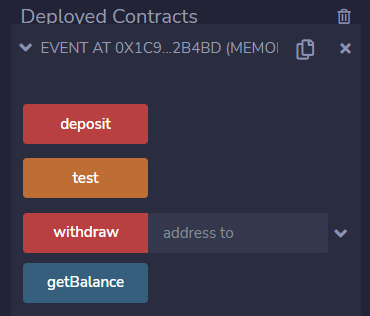
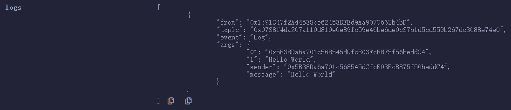
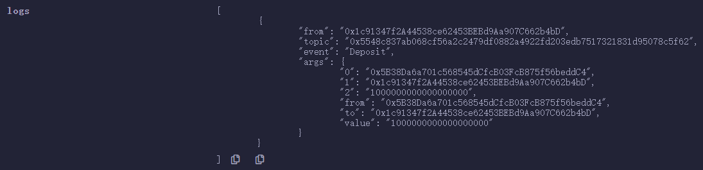
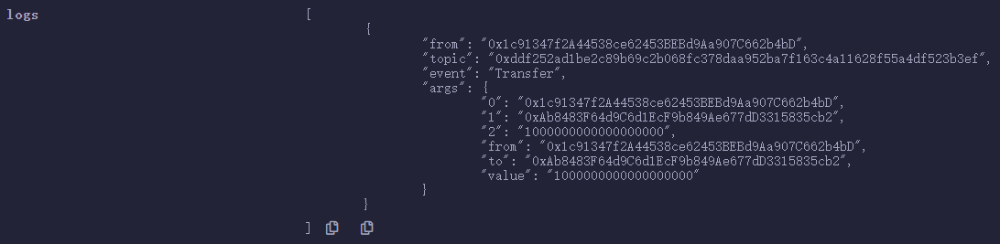

# 第19章 事件

## 基本概念

Solidity语言中关于事件（Event）的定义如下：

+ 事件是能方便地调用以太坊虚拟机（EVM）日志功能的接口；
+ 当事件被调用时，参数被存储到区块链交易的日志中 ，这些日志与地址相关联，会被永久保存；
+ 日志和事件在合约内不可直接被访问（甚至是创建日志的合约也不能访问）；
+ 应用程序可以通过以太坊客户端的RPC接口订阅和监听这些事件。

## 声明语法

### 声明事件

合约中事件的声明语法如下：

```
event <event name>(<paramslist>);
```

其中：

+ `event`：事件的关键字；
+ `<event name>`：事件的名称；
+ `<paramslist>`：事件的参数。

最多有三个参数可以接收 `indexed` 属性，它是一个名为"主题"（topic）的数据结构，不作为日志的数据部分。主题仅有32字节，因此如果引用类型（数组、结构和映射）被标记为索引项，则它们的keccak-256哈希值会被作为主题保存。

所有非 `indexed` 属性的参数都将存储在日志的数据部分中。

主题（topic）让我们可以搜索事件，比如为某些事件过滤区块，还可以按发起事件的合约地址来过滤事件。

### 触发事件

合约中通过 `emit` 来触发事件，语法如下：

```
emit <event name>(param1, param2, ...);
```

## 合约例子

下面是一个合约例子，用来演示事件的声明与用法。

```
// SPDX-License-Identifier: MIT
pragma solidity ^0.8.13;

// 事件示例
contract Event {
    // 声明事件
    event Log(address indexed sender, string message);
    event Deposit(address indexed from, address indexed to, uint value);
    event Transfer(address indexed from, address indexed to, uint value);

    // 取合约余额
    function getBalance() public view returns(uint) {
        return address(this).balance;
    }

    // 事件测试
    function test() public {
        emit Log(msg.sender, "Hello World");
    }

    // 存入以太币到合约
    function deposit() public payable {
        emit Deposit(msg.sender, address(this), msg.value);
    }

    // 提取合约中以太币
    function withdraw(address to) public payable {
        uint value = address(this).balance;
        payable(to).transfer(address(this).balance);
        emit Transfer(address(this), to, value);
    }
}
```

## 合约执行

我们在Remix中编译、部署和运行这个合约例子。



**1. 执行test()函数，事件输出日志如下图：**



**2. 执行deposit()函数，事件输出日志如下图：**



**3. 执行withdraw()函数，事件输出日志如下图：**



## 课程小结

本课程我们介绍了事件，包括事件的声明语法与事件的触发。并且通过合约例子演示了事件的声明与用法。

