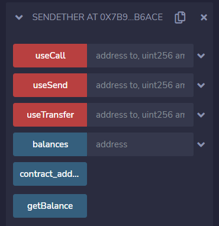

# 第25章 发送以太币

## 基本概念

在Solidity语言中，你可以向一个以太坊帐号或合约地址发送以太币。

有以下几种方法可以发送以太币：

+ transfer 函数
+ send 函数
+ call 函数调用

## 发送以太币

Solidity语言中有以下三种发送以太币（转账）的方式：

1. transfer 函数

   ```
   <address>.transfer()
   ```

   如果异常会转账失败，抛出异常，终止执行。有 gas 限制，最多 2300。

2. send 函数

   ```
   <address>.send()
   ```

   如果异常会转账失败，返回 false，不会终止执行。有 gas 限制，最多2300。

3. call 函数调用方式

   ```
   <address>.call{...}()
   ```

   如果异常会转账失败，返回 false，不会终止执行。无 gas 限制，默认发送所有剩余 gas。

**注意：因为 call 函数调用无 gas 限制，默认会使用所有剩余的 gas，这也给了恶意合约发起重入攻击的条件，所以不能有效的防止重入攻击。**

## 接受以太币

一个合约如果需要接收以太币，必须定义 `receive()` 或 `fallback()` 函数。

函数语法如下：

```
receive() external payable
fallback() external payable
```

首先检查是否定义了 `receive()` 函数，如果没有则调用 `fallback()` 函数。

## 如何安全转账

有以下几种方法可以有效的防止重入（Re-entrancy）攻击：

1. 建议使用 `transfer()` 函数来发送以太币。因为该转账功能只与外部调用一起发送 2300 个 gas，这不足以让攻击合约再去调用另一个合约（即重新进入发送合约）
2. 建议遵循检查-效果-交互的编程模式。即确保所有改变状态变量的逻辑在发送以太币（或任何外部调用）之前发生。将执行未知地址外部调用的代码（转账操作）作为代码段执行的最后一个操作。

以上两种方法的组合应用能有效的防止重入攻击的发生。

## 合约例子

合约文件名：SendEther.sol

下面是一个合约例子，用来演示以上几种以太币转账函数的用法。

```
// SPDX-License-Identifier: MIT
pragma solidity ^0.8.13;

// 接收以太币
contract ReceiveEther {
    // receive 函数
    receive() external payable {}

    // fallback 函数
    fallback() external payable {}

    // 取合约余额
    function getBalance() public view returns(uint) {
        return address(this).balance;
    }
}

// 发送以太币
contract SendEther {
    // 合约地址及地址余额映射
    address public contract_address;
    mapping(address => uint) public balances;

    // 构造函数
    constructor() payable {
        contract_address = address(this);
        balances[contract_address] = msg.value;
    }

    // 取合约余额
    function getBalance() public view returns(uint) {
        return balances[contract_address];
    }

     // transfer 函数
    function useTransfer(address payable to, uint amount) public payable {
        require(balances[contract_address] > amount, "No enough ether");
        balances[contract_address] -= amount;
        to.transfer(amount);
    }

    // send 函数
    function useSend(address payable to, uint amount) public payable returns(bool) {
        require(balances[contract_address] > amount, "No enough ether");
        balances[contract_address] -= amount;
        bool success = to.send(amount);
        return success;
    }

    // call 函数
    function useCall(address payable to, uint amount) public payable returns(bool, bytes memory) {
        require(balances[contract_address] > amount, "No enough ether");
        balances[contract_address] -= amount;
        (bool success, bytes memory data) = to.call{value: amount}("");
        return (success, data);
    }
}
```

**输出**： 我们在Remix中编译、部署和运行这个合约例子，执行结果如下：



## 课程小结

本课程我们介绍了发送以太币（转账），包括发送以太币的几种方式，如何接收以太币以及如何安全的发送以太币，并且通过一个合约例子演示了几种发送以太币的使用方法以及它们之间的区别。

