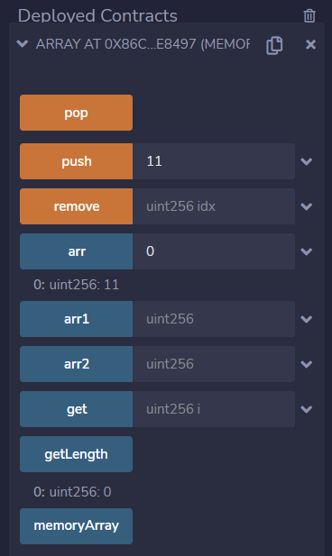
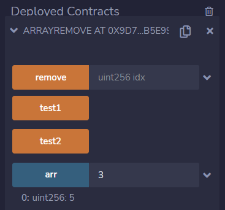

# 第3章 数组

## 基本概念

Solidity中关于数组的定义如下：

+ 数组是存储相同数据类型的固定元素集合的数据结构；
+ 数组可以在声明时指定长度，也可以动态调整大小（长度）；
+ 数组具有连续的内存位置，通过索引访问数组中的元素，索引从0开始；
+ 数组元素可以是任何有效的Solidity数据类型，包括映射或结构体。

## 创建数组

### 声明语法

创建数组的语法如下：

```
<data type>[size] <array name> = <initialization>
```

### 数组类型

#### 定长数组

指数组的大小需要在声明时预定义，元素的总数不应该超过数组的大小。如果数组在声明时没有进行初始化，则数组中元素为默认值（如对于存储整型值的数组，其元素的默认值为0）。

定长数组的声明与初始化有以下两种方法：

```
uint[] a = [1, 2, 3];
uint[3] b;
```

数组 `a` 定义了3个元素，并初始化为 [1, 2, 3]，即 a[0] = 1, a[1] = 2, a[2] = 3。

数组 `b` 定义了3个元素，所有元素初始化为0，即指定数据类型的默认值。

#### 动态数组

声明数组时，数组的大小没有预定义。数组的大小随元素的添加会改变，在运行时数组的大小将被确定。

动态数组的声明如下：

```
uint[] a;
```

动态数组由于没有指定数组长度，所以没有初始化值。

#### 内存数组

可使用 `new` 关键字在内存（memory）中基于运行时动态创建固定长度的数组。与 存储（storage）数组相反的是，你不能通过修改成员变量 `.push` 改变内存（memory）数组的大小，即内存数组创建后的长度是固定的。

创建内存数据的语法如下：

```
uint[] memory a = new uint[](5);
```

动态数组中的元素总是以默认值初始化。

## 数组成员

**length**

数组的 `length` 变量用于检查数组中存在的元素的数量。内存数组的大小在声明时是固定的，而如果动态数组是在运行时定义的，则需要操作长度。

**push(x)**

数组的 `push` 函数用于在动态数组中添加新元素。新元素总是添加在数组的最后一个位置。如果带 `x` 参数则向数组添加给定值的元素，并且没有返回。如果不带 `x` 参数则向数组添加初始化元素，并返回元素的引用。

**pop()**

数组的 `pop` 函数用于从动态数组的末尾移除元素，并在移除的元素上隐含调用 `delete`。

## 合约例子

### 例子1

数组的声明及基本操作。

```
// SPDX-License-Identifier: MIT
pragma solidity ^0.8.13;

// 定长数组
contract Array {
    // 定长数组
    uint[] public arr1 = [1, 2, 3];
    uint[10] public arr2;

    // 动态数组
    uint[] public arr;

    // 取数组元素
    function get(uint i) public view returns(uint) {
        return arr[i];
    }

    // 取数组长度
    function getLength() public view returns(uint) {
        return arr.length;
    }

    // 添加一个元素到数组
    function push(uint i) public {
        arr.push(i);
    }

    // 移除数组中最后一个元素
    function pop() public {
        arr.pop();
    }

    /*
        删除数组中某个元素
        删除元素不改变数组的长度，指定索引的元素值被重置为默认值(0)
    */
    function remove(uint idx) public {
        delete arr[idx];
    }

    // 创建一个内存数组
    function memoryArray() public pure returns(uint[] memory){
        uint[] memory a = new uint[](10);
        // 给元素赋值
        for (uint i = 0; i < a.length; i++)
            a[i] = i;
        return a;
    }
}
```

**输出** ：我们在Remix中编译、部署和运行上面的合约例子，执行结果如下图：



### 例子2

移除动态数组中的元素（元素从右向左移动），并改变数组长度。

```
// SPDX-License-Identifier: MIT
pragma solidity ^0.8.13;

// 移除动态数组中的元素(元素从右向左移动)
contract ArrayRemove {
    // [1, 2, 3] -- remove(1) --> [1, 3, 3] --> [1, 3]
    // [1, 2, 3, 4, 5] -- remove(2) --> [1, 2, 4, 5, 5] --> [1, 2, 4, 5]
    // [1] -- remove(0) --> [1] --> []
    uint[] public arr;

    // 移除数组元素
    function remove(uint idx) public {
        require(idx < arr.length, "index out of range");

        // 指定索引右边的元素从右向左移动
        for (uint i = idx; i < arr.length - 1; i++)
            arr[i] = arr[i + 1];
        arr.pop();
    }

    // test1
    function test1() public {
        arr = [1, 2, 3, 4, 5];
        remove(2);
        // [1, 2, 4, 5]
        assert(arr[0] == 1);
        assert(arr[1] == 2);
        assert(arr[2] == 4);
        assert(arr[3] == 5);
        assert(arr.length == 4);
    }

    // test2
    function test2() public {
        arr = [1];
        remove(0);
        // []
        assert(arr.length == 0);
    }
}
```

**输出**： 我们在Remix中编译、部署和运行上面的合约例子，执行结果如下图：



## 课程小结

本课程我们介绍了数组，包括数组的类型（定长数组、动态数组和内存数组），数组的声明与初始化，以及数组的成员变量和函数。并且通过两个合约例子演示了数组的定义与基本操作，以及移除数组中元素的方法。

