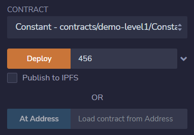
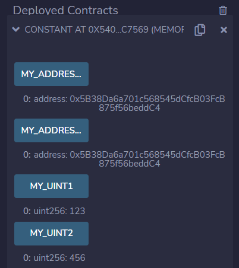

# 第6章 常量和不可变量

## 基本概念

常量是指不能修改的变量（状态变量）。在合约中使用常量可以节省Gas费用。

## 常量类型

Solidity语言定义了两种常量类型：

+ `constant`

  常量的关键字。除了初始化外禁止赋值。常量不占用存储槽位，即没有Gas费用。

+ `immutable`

  不可变量的关键字。只允许在构造时赋值一次，之后同常量一样，也没有Gas费用。

## 声明语法

常量的定义语法如下：

```
<data type> <access specifier> constant <name> = <initialization>;
<data type> <access specifier> immutable <name>;
```

例如：

```
uint public constant MY_UINT1 = 123;
uint public immutable MY_UINT2;
```

## 合约例子

下面是一个合约例子，用来演示常量和不可变量的声明与用法。

```
// SPDX-License-Identifier: MIT
pragma solidity ^0.8.13;

// 常量和不可变量
contract Constant {
    // constant 遵循大写命名规则
    uint public constant MY_UINT1 = 123;
    address public constant MY_ADDRESS1 = 0x5B38Da6a701c568545dCfcB03FcB875f56beddC4;

    // immutable 遵循大写命名规则
    uint public immutable MY_UINT2;
    address public immutable MY_ADDRESS2;

    // 构造函数
    constructor(uint _myUint) {
        MY_UINT2 = _myUint;
        MY_ADDRESS2 = msg.sender;
    }
}
```

**输出**：我们在Remix中编译、部署和运行这个合约例子。

合约部署界面如下图：



合约执行结果如下图：



## 课程小结

本课程我们介绍了常量和不可变量，包括常量与不可变量的变量声明与初始化，他们之间的区别与相同点。并且通过一个合约例子演示了常量和不可变量的定义与初始化。
