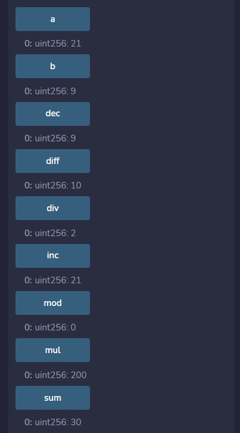
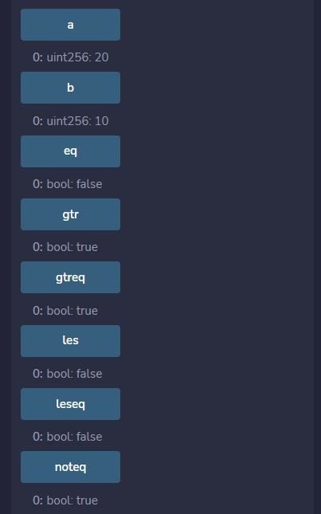
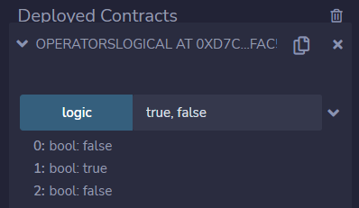
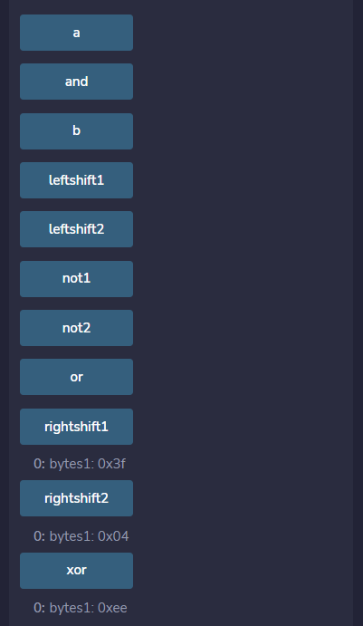
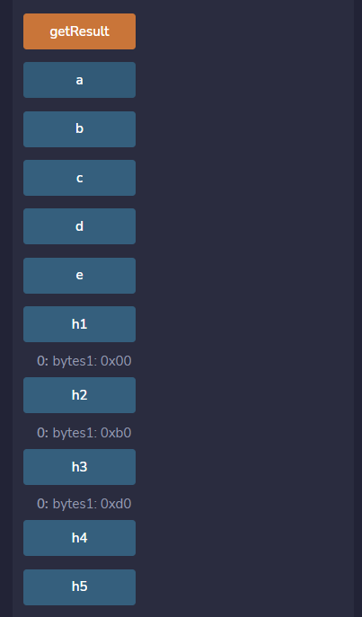
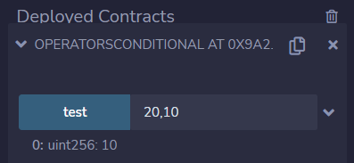

# 第9章 操作符

## 基本概念

Solidity语言支持以下几种类型的操作符（运算符）：

1. 算术运算符
2. 关系运算符
3. 逻辑运算符
4. 按位运算符
5. 赋值运算符
6. 条件运算符
7. delete操作符

## 运算符类型

### 算术运算符

算术运算符用于执行算术或数学运算。Solidity语言支持以下算术运算符：

| 名称 | 运算符 | 描述                                                       |
| ---- | ------ | ---------------------------------------------------------- |
| 加法 | +      | 用于将两个操作数相加                                       |
| 减法 | -      | 用于从第一个操作数减去第二个操作数                         |
| 乘法 | *      | 用于两个操作数相乘                                         |
| 除法 | /      | 用于将分子除以分母（分子小于分母时结果为0，除数是0时报错） |
| 取模 | %      | 取整数除法后的余数                                         |
| 自增 | ++     | 将整数值增加1                                              |
| 自减 | --     | 将整数值减少1                                              |
| 求幂 | **     | 将第一个操作数按第二个操作数求幂                           |

**例子**：在下面的例子中，演示了上面提到的不同类型的算术运算符。

```
// SPDX-License-Identifier: MIT
pragma solidity ^0.8.13;

// 算术运算符
contract OperatorsArithmetic {
    // 变量初始化
    uint public a = 20;
    uint public b = 10;

    // 加法
    uint public sum = a + b;

    // 减法
    uint public diff = a - b;

    // 乘法
    uint public mul = a * b;

    // 除法
    uint public div = a / b;

    // 取模
    uint public mod = a % b;
    
    // 求幂
    uint public pow = a ** 2;

    // 自增
    uint public inc1 = ++a; // 前缀自增，先加1再赋值
    uint public inc2 = a++; // 后缀自增，先赋值再加1

    // 自减
    uint public dec1 = --b; // 前缀自减，先减1再赋值
    uint public dec2 = b--; // 后缀自减，先赋值再减1
}
```

**输出**：我们在Remix中编译、部署和运行这个合约例子。执行结果如下图。



### 关系运算符

关系运算符用于比较两个值。Solidity语言支持以下关系运算符:

| 名称     | 运算符 | 描述                                                     |
| -------- | ------ | -------------------------------------------------------- |
| 等于     | ==     | 检查两个值是否相等，如果相等则返回true，否则返回false    |
| 不等于   | !=     | 检查两个值是否相等，如果不相等则返回true，否则返回false  |
| 大于     | >      | 检查左值是否大于右值，如果大于返回true，否则返回false    |
| 小于     | <      | 检查左值是否小于右值，如果小于返回true，否则返回false    |
| 大于等于 | \>=    | 检查左值是否大于等于右值，如果大于等于返回true，反之亦然 |
| 小于等于 | <=     | 检查左值是否小于等于右值，如果小于等于返回true，反之亦然 |

**例子**：在下面的例子中，演示了上面提到的不同类型的关系运算符。

```
// SPDX-License-Identifier: MIT
pragma solidity ^0.8.13;

// 关系运算符
contract OperatorsRelational {
    // 变量初始化
    uint public a = 20;
    uint public b = 10;

    // 等于
    bool public eq = a == b;

    // 不等于
    bool public noteq = a != b;

    // 大于
    bool public gtr = a > b;
    
    // 小于
    bool public les = a < b;

    // 大于等于
    bool public gtreq = a >= b;

    // 小于等于
    bool public leseq = a <= b;
}
```

**输出**：我们在Remix中编译、部署和运行这个合约例子。执行结果如下图。



### 逻辑运算符

逻辑运算符用于组合两个或多个条件。Solidity语言支持以下逻辑运算符。

| 名称   | 运算符 | 描述                                                         |
| ------ | ------ | ------------------------------------------------------------ |
| 逻辑与 | &&     | 如果两个条件都为真，则返回真，如果一个或两个条件都为假，则返回假 |
| 逻辑或 | \|\|   | 如果一个或两个条件都为真，则返回真，如果两个条件都为假，则返回假 |
| 逻辑非 | !      | 如果条件不满足则返回true，否则返回false                      |

**例子**：在下面的例子中，演示了上面提到的不同类型的逻辑运算符。

```
// SPDX-License-Identifier: MIT
pragma solidity ^0.8.13;

// 逻辑运算符
contract OperatorsLogical {
    // 逻辑运算函数
    function logic(bool a, bool b) public pure returns(bool, bool, bool) {
        // 逻辑与
        bool and = a && b;

        // 逻辑或
        bool or = a || b;

        // 逻辑非
        bool not = !a;

        return(and, or, not);
    }
}
```

**输出**：我们在Remix中编译、部署和运行这个合约例子。执行结果如下图。



### 按位运算符

按位运算符在用于执行位级操作的位的运算。Solidity语言支持以下按位运算符:

| 名称     | 运算符 | 描述                                                   |
| -------- | ------ | ------------------------------------------------------ |
| 按位与   | &      | 对整型参数的每一位执行布尔与运算                       |
| 按位或   | \|     | 对整型参数的每一位执行布尔或运算                       |
| 按位异或 | ^      | 对整型参数的每一位执行布尔异或操作                     |
| 按位非   | ~      | 对整型参数的每一位执行布尔NOT操作                      |
| 左移     | <<     | 将第一个操作数的所有位按第二个操作数指定的位数向左移动 |
| 右移     | \>>    | 将第一个操作数的所有位按第二个操作数指定的位数向右移动 |

**例子**：在下面的例子中，演示了上面提到的不同类型的按位运算符。

```
// SPDX-License-Identifier: MIT
pragma solidity ^0.8.13;

// 按位运算符
contract OperatorsBitwise {
    // 变量初始化
    bytes1 public a = 0xff;     // 11111111
    bytes1 public b = 0x11;     // 00010001

    // 按位与
    bytes1 public and = a & b;  // 00010001 => 0x11

    // 按位或
    bytes1 public or = a | b;   // 11111111 => 0xff

    // 按位异或
    bytes1 public xor = a ^ b;  // 11101110 => 0xee

    // 按位非
    bytes1 public not1 = ~a;     // 00000000 => 0x00
    bytes1 public not2 = ~b;     // 11101110 => 0xee

    // 左移
    bytes1 public leftshift1 = a << 2;  // 11111100 => 0xfc
    bytes1 public leftshift2 = b << 2;  // 01000100 => 0x44

    // 右移
    bytes1 public rightshift1 = a >> 2; // 00111111 => 0x3f
    bytes1 public rightshift2 = b >> 2; // 00000100 => 0x04
}
```

**输出**：我们在Remix中编译、部署和运行这个合约例子。执行结果如下图。



### 赋值运算符

赋值运算符用于给变量赋值。左边的操作数是变量，右边的操作数是值。Solidity语言支持以下赋值运算符:

| 名称         | 运算符 | 描述                                                       |
| ------------ | ------ | ---------------------------------------------------------- |
| 简单赋值     | =      | 只需将右边的值赋给左边的操作数                             |
| 加法赋值     | +=     | 将右边的操作数加上左边的操作数后的值赋给左边的操作数       |
| 减法赋值     | -=     | 将左边的操作数减去右边的操作数后的值赋给左边的操作数       |
| 乘法赋值     | *=     | 将两个操作数相乘后的值赋给左操作数                         |
| 除法赋值     | /=     | 将左边的操作数除以右边的操作数后的值赋给左边的操作数       |
| 取模赋值     | %=     | 将左边的操作数除以右边的操作数后的余数赋给左边的操作数     |
| 按位与赋值   | &=     | 将左边的操作数与右边的操作数按位与后的值赋给左边的操作数   |
| 按位或赋值   | \|=    | 将左边的操作数与右边的操作数按位或后的值赋给左边的操作数   |
| 按位异或赋值 | ^=     | 将左边的操作数与右边的操作数按位异或后的值赋给左边的操作数 |
| 左移赋值     | <<=    | 将左边的操作数左移右边的操作数位数后的值赋给左边的操作数   |
| 右移赋值     | \>>=   | 将左边的操作数右移右边的操作数位数后的值赋给左边的操作数   |

**例子**：在下面的例子中，演示了上面提到的不同类型的赋值运算符。

```
// SPDX-License-Identifier: MIT
pragma solidity ^0.8.13;

// 条件运算符
contract OperatorsAssignment {
    // 变量
    uint public a = 10;
    uint public b = 20;
    uint public c = 30;
    uint public d = 40;
    uint public e = 50;
    bytes1 public h1 = 0xa0;    // 10100000
    bytes1 public h2 = 0xb0;    // 10110000
    bytes1 public h3 = 0xc0;    // 11000000
    bytes1 public h4 = 0xd0;    // 11010000
    bytes1 public h5 = 0xe0;    // 11100000

    // 函数
    function getResult() public {
        // 加、减、乘、除、取模
        a += 10;    // 20
        b -= 10;    // 10
        c *= 10;    // 300
        d /= 10;    // 4
        e %= 10;    // 0

        // 按位与、或、异或
        h1 &= 0x10; // 10100000 & 00010000 => 00000000 => 0x00
        h2 |= 0x10; // 10110000 | 00010000 => 10110000 => 0xb0
        h3 ^= 0x10; // 11000000 ^ 00010000 => 11010000 => 0xd0

        // 左移、右移
        h4 <<= 2;   // 01000000 => 0x40
        h5 >>= 2;   // 00111000 => 0x38
    }
}
```

**输出**：我们在Remix中编译、部署和运行这个合约例子。执行结果如下图。



### 条件运算符

条件运算符是一个三元操作符，它首先计算表达式，然后检查对应于true或false的返回值的条件。

**语法**

```
if condition true ? then A: else B
```

**例子**：在下面的例子中，演示了上面提到的条件运算符。

```
// SPDX-License-Identifier: MIT
pragma solidity ^0.8.13;

// 条件运算符
contract OperatorsConditional {
    // 函数
    function test(uint a, uint b) public pure returns(uint) {
        uint result = a > b ? a - b : b - a;
        return result;
    }
}
```

**输出**：我们在Remix中编译、部署和运行这个合约例子。执行结果如下图。



### delete操作符

delete操作符语法如下：

```
delete a
```

`delete` 除适用于值类型变量外，也适用于数组和结构体，但对映射无效。以上语句的结果是将变量 `a` 类型的初始值赋值给 `a`。

+ 对于整型变量，相当于 `a = 0`；
+ 对于动态数组，相当于重置为数组长度为0的数组；
+ 对于静态数组，相当于将数组中的所有元素重置为初始值；
+ 对于数组，`delete a[x]` 仅删除数组索引 `x` 处的元素，其他的元素和长度不变；
+ 对于结构体，相当于将结构体中的所有属性（成员）重置。

## 运算符优先级

下面是操作符的优先级顺序，按求值顺序列出。

| 优先级 | 描述                 | 运算符                                       |
| ------ | -------------------- | -------------------------------------------- |
| 1      | 后缀增量和减量运算符 | ++, --                                       |
|        | New表达式            | new \<typename>                              |
|        | 数组下标             | \<array>[\<index>]                           |
|        | 对象成员             | \<object>.\<member>                          |
|        | 函数调用             | \<func>(<args...>)                           |
|        | 圆括号               | (\<statement>)                               |
| 2      | 前缀增量和减量运算符 | ++, --                                       |
|        | 一元减号             | -                                            |
|        | 一元运算             | delete                                       |
|        | 逻辑非               | !                                            |
|        | 按位非               | ~                                            |
| 3      | 指数                 | **                                           |
| 4      | 乘法、除法和取模     | *, /, %                                      |
| 5      | 加法、减法           | +, -                                         |
| 6      | 按位移动运算符       | <<, >>                                       |
| 7      | 按位与               | &                                            |
| 8      | 按位异或             | ^                                            |
| 9      | 按位或               | \|                                           |
| 10     | 不等式运算符         | \>, <, >=, <=                                |
| 11     | 等式运算符           | ==, !=                                       |
| 12     | 逻辑与               | &&                                           |
| 13     | 逻辑或               | \|\|                                         |
| 14     | 三元运算符           | \<conditional> ? \<if-true> : \<if-false>    |
|        | 赋值运算符           | =, \|=, ^=, &=, <<=, >>=, +=, -=, *=, /=, %= |
| 15     | 逗号                 | ,                                            |

## 课程小结

本课程我们介绍了操作符，包括操作符的类型以及每一个操作符的定义，还介绍了操作符的优先级排序。并且通过合约例子演示了不同类型操作符的用法。

